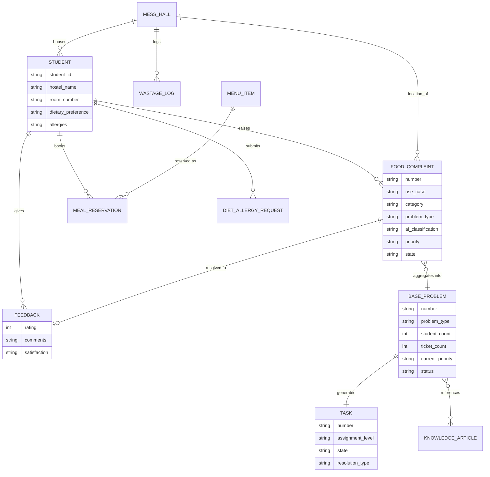

# Campus Food Services Assistant — ServiceNow Build Document
### Tech Titans | K.S.R.M. College of Engineering | LTM HackNow

---

## 1. Actors & Roles

| Role | Description | Key Permissions |
|---|---|---|
| **Student** | Raises tickets, requests, feedback | Create/read own tickets, submit feedback |
| **Staff** (Mess/Kitchen Supervisor) | First-line responder | Update assigned tasks, mark resolved/not resolved |
| **Hostel Admin / Warden** | Handles escalated (High) problems | Full read on Base Problems, reassign, approve diet/allergy requests |
| **Manager** (Chief Hostel Administrator) | Handles Critical escalations | Full dashboard access, override priority |
| **Dietician** | Approves special diet/allergy requests | Approve/reject diet requests |
| **System Administrator** | Configures thresholds, ACLs, integrations | Full admin |

---

## 2. Complete Entity List with Fields

### 2.1 Student — `u_student` (extends `sys_user` via reference, or custom table)
| Field Label | Field Name | Type | Mandatory | Reference | Notes |
|---|---|---|---|---|---|
| User | user | Reference | Yes | sys_user | Links to platform login |
| Hostel Name | hostel_name | String(100) | Yes | — | |
| Room Number | room_number | String(20) | Yes | — | |
| Mess Hall | mess_hall | Reference | Yes | u_mess_hall | Assigned mess |
| Dietary Preference | dietary_preference | Choice | No | — | Veg/Non-Veg/Vegan/Halal/Jain |
| Allergies | allergies | String(255) | No | — | Free text or multi-choice |
| Student ID | student_id | String(20) | Yes | — | Unique |

### 2.2 Mess Hall — `u_mess_hall`
| Field | Type | Mandatory | Notes |
|---|---|---|---|
| Name | String(100) | Yes | e.g., Mess Hall B |
| Location | String(100) | No | |
| Supervisor | Reference (sys_user) | Yes | Assigned staff group head |
| Capacity | Integer | No | |

### 2.3 Food Complaint / Case — `u_food_complaint` (extends `sn_customerservice_case` or base `task`)
| Field Label | Field Name | Type | Mandatory | Reference | Notes |
|---|---|---|---|---|---|
| Number | number | String | Auto | — | FC-2026-XXX |
| Student | student | Reference | Yes | u_student | |
| Use Case | use_case | Choice | Yes | — | 1 of the 12 use cases |
| Category | category | Choice | Yes | — | Food Quality/Hygiene/Availability/etc. |
| Problem Type | problem_type | String(100) | No | — | e.g., "Undercooked Rice" (AI-derived) |
| Mess Hall | mess_hall | Reference | Yes | u_mess_hall | |
| Meal Type | meal_type | Choice | Yes | — | Breakfast/Lunch/Dinner/Snacks |
| Description | description | Text | Yes | — | Student's complaint text |
| Attachment | attachment | Attachment | No | — | Photo/video |
| AI Classification | ai_category | String(100) | Auto | — | AI-tagged category |
| AI Confidence | ai_confidence | Percentage | Auto | — | 0–100% |
| Base Problem | base_problem | Reference | Auto | u_base_problem | Linked after matching (Sec 3) |
| Priority | priority | Choice | Auto/Override | — | Low/Medium/High/Critical |
| State | state | Choice | Yes | — | New/In Progress/Resolved/Not Resolved/Closed |
| Assigned Group | assignment_group | Reference | Auto | sys_user_group | |
| Assigned To | assigned_to | Reference | Auto | sys_user | |
| Resolution Notes | resolution_notes | Text | Cond. | — | Required on Resolved |
| Feedback Eligible | feedback_eligible | Boolean | Auto | — | True after Resolved |

### 2.4 Base Problem / Recurring Issue — `u_base_problem`
| Field | Type | Mandatory | Notes |
|---|---|---|---|
| Number | String | Auto | BP-2026-XXX |
| Use Case | Choice | Yes | |
| Category | Choice | Yes | |
| Problem Type | String(100) | Yes | Matching key |
| Mess Hall | Reference (u_mess_hall) | Yes | |
| Student Count (unique) | Integer | Auto | |
| Ticket Count (total) | Integer | Auto | May exceed student count |
| Open Ticket Count | Integer | Auto | |
| Resolved Ticket Count | Integer | Auto | |
| First Ticket | Reference (u_food_complaint) | Auto | Immutable once set |
| Latest Ticket | Reference (u_food_complaint) | Auto | |
| First Reported | Date/Time | Auto | |
| Latest Reported | Date/Time | Auto | |
| Threshold (Medium/High/Critical) | Integer x3 | Config | Admin-configurable |
| Current Priority | Choice | Auto | Low/Medium/High/Critical |
| Priority Reason | Text | Auto | AI-generated explanation |
| AI Risk Score | Decimal | Auto | 0–100 |
| AI Summary | Text | Auto | |
| Knowledge Insights | Text | Auto | Retrieved KB/circular references |
| Recommended Action | Text | Auto | |
| Assigned Group | Reference (sys_user_group) | Auto | |
| Assigned User | Reference (sys_user) | Auto | |
| Status | Choice | Auto | Active/Monitoring/Resolved |

### 2.5 Task — `u_problem_task` (extends base `task`)
| Field | Type | Mandatory | Notes |
|---|---|---|---|
| Parent Base Problem | Reference (u_base_problem) | Yes | |
| Related Tickets | Related list | Auto | via u_food_complaint.base_problem |
| Priority | Choice | Auto | Inherited from Base Problem |
| AI Reasoning | Text | Auto | |
| SLA / Response Target | Reference (sla_definition) | Auto | |
| Assignment Level | Choice | Auto | Staff/Admin/Manager |
| Assignment History | Related list (sys_audit) | Auto | |
| State | Choice | Yes | Open/Assigned/In Progress/On Hold/Resolved/Rejected |
| Resolution Type | Choice | Cond. | Resolved / Not Resolved |
| Not-Resolved Reason | Text | Cond. | Required if Not Resolved |

### 2.6 Menu Item — `u_menu_item`
| Field | Type | Mandatory | Notes |
|---|---|---|---|
| Item Name | String(100) | Yes | |
| Meal Type | Choice | Yes | Breakfast/Lunch/Dinner |
| Allergens | Multi-choice | No | |
| Dietary Tags | Multi-choice | No | Veg/Vegan/Halal/Gluten-Free |

### 2.7 Meal Reservation — `u_meal_reservation`
| Field | Type | Mandatory | Notes |
|---|---|---|---|
| Student | Reference (u_student) | Yes | |
| Meal Slot / Menu Item | Reference (u_menu_item) | Yes | |
| Reservation Date | Date | Yes | |
| Status | Choice | Auto | Reserved/Cancelled/Fulfilled |

### 2.8 Diet / Allergy Request — `u_diet_allergy_request`
| Field | Type | Mandatory | Notes |
|---|---|---|---|
| Student | Reference (u_student) | Yes | |
| Request Type | Choice | Yes | Diet/Allergy |
| Details | Text | Yes | |
| Supporting Document | Attachment | No | Medical proof |
| Approval Status | Choice | Auto | Pending/Approved/Rejected |
| Approved By | Reference (sys_user) | Cond. | Dietician |

### 2.9 Wastage Log — `u_wastage_log`
| Field | Type | Mandatory | Notes |
|---|---|---|---|
| Mess Hall | Reference (u_mess_hall) | Yes | |
| Date | Date | Yes | |
| Meal Type | Choice | Yes | |
| Quantity Wasted (kg) | Decimal | Yes | |
| Reported By | Reference (sys_user) | No | |

### 2.10 Feedback — `u_feedback`
| Field | Type | Mandatory | Notes |
|---|---|---|---|
| Student | Reference (u_student) | Yes | |
| Ticket | Reference (u_food_complaint) | Yes | |
| Base Problem | Reference (u_base_problem) | Auto | |
| Rating | Integer(1–5) | Yes | |
| Comments | Text | No | |
| Resolution Satisfaction | Choice | Yes | Satisfied/Neutral/Unsatisfied |
| Submitted Date | Date/Time | Auto | |

### 2.11 Knowledge / Circular Link — reference to `kb_knowledge`
No new table — Base Problem uses a related list against `kb_knowledge` (native Knowledge Management) filtered by category/keyword match.

### 2.12 Audit / Notification Log — native `sys_audit` + `sysevent_email_log`
No custom table required — use ServiceNow-native history and email/notification logs.

---

## 3. Relationships

- **Student → Food Complaint**: one-to-many (reference field `student` on Food Complaint)
- **Food Complaint → Base Problem**: many-to-one (reference field `base_problem` on Food Complaint) — chosen over many-to-many because each ticket represents exactly one recurring problem instance; a simple reference field is the cleanest native ServiceNow pattern and keeps counts trivial to roll up.
- **Base Problem → Task**: one-to-one (each Base Problem has one live task; escalations update the same task rather than spawning duplicates — see Section 6)
- **Task → Related Tickets**: one-to-many via Base Problem (indirect)
- **Food Complaint → Feedback**: one-to-one (post-resolution)
- **Student → Meal Reservation / Diet Request / Wastage Log**: one-to-many
- **Base Problem → Knowledge Article**: many-to-many (related list, native `kb_knowledge` relation table)

## 4. ER Diagram

---

## 5. Flow Designer Flows (Automation)

| # | Flow Name | Trigger | Key Actions | Output |
|---|---|---|---|---|
| 1 | Student Ticket Creation | Record created: u_food_complaint | Validate mandatory fields, generate number | New ticket |
| 2 | AI Classification | After Flow 1 | Call GenAI/AI Agent → category, problem_type, confidence | Ticket enriched |
| 3 | Base Problem Matching/Creation | After Flow 2 | Look up Base Problem by (use_case + category + problem_type + mess_hall); if none, create | ticket.base_problem set |
| 4 | Student/Ticket Count Update | After Flow 3 | Increment counts, update latest ticket/time on Base Problem | Base Problem updated |
| 5 | AI Priority Calculation | After Flow 4 | Evaluate count, threshold, time delay, category risk → priority + reason | Base Problem priority set |
| 6 | Knowledge/Circular Analysis | After Flow 5 | AI Search against kb_knowledge → attach top matches + summary | Base Problem enriched |
| 7 | Task Creation | If no open task exists on Base Problem | Create u_problem_task, copy context fields | Task created |
| 8 | Initial Assignment | After Flow 7 | Route by priority (Low→Staff, Med→Staff, High→Admin, Critical→Manager) | assignment_group/user set |
| 9 | Assignment Notification | After Flow 8 | Notify assigned group/user | Email/push sent |
| 10 | Priority Recalculation | Scheduled + on new ticket match | Re-run Flow 5 logic | Priority updated if changed |
| 11 | Threshold Detection | After Flow 10 | Compare new priority to old | Trigger Flow 12 if escalated |
| 12 | Escalation | If priority increased | Update existing task's assignment level (not new task); log history | Task reassigned |
| 13 | Escalation Notification | After Flow 12 | Notify new assignee only (suppress duplicate to same person) | Email/push sent |
| 14 | Resolution | Staff sets state = Resolved | Require resolution_notes, update ticket + Base Problem status, set feedback_eligible = true | Student notified |
| 15 | Not Resolved | Staff sets state = Not Resolved | Require reason, keep Base Problem Active, optionally re-trigger Flow 11 | Task stays open |
| 16 | Feedback Enablement | After Flow 14 | Expose feedback form on ticket | Student can submit |
| 17 | Feedback Submission | Record created: u_feedback | Link to ticket/Base Problem/resolution | Analytics updated |
| 18 | Dashboard/Analytics Update | Scheduled (async) | Refresh Performance Analytics data collectors | Dashboards refreshed |

---

## 6. Duplicate-Task Prevention Logic (Escalation)
When priority changes (e.g., Low → Medium → High → Critical):
- **Do NOT create a new task.** Update the existing `u_problem_task` record: change `assignment_level`, `assignment_group`, `assigned_to`.
- Log every change to `sys_audit_history` (native) with: previous priority, new priority, previous assignee, new assignee, reason, timestamp, trigger source (ticket count / time / manual).
- Only one open task per Base Problem at any time.

---

## 7. State Models

**Food Complaint / Ticket:**
`New → In Progress → Resolved → Closed`
alt path: `New → In Progress → Not Resolved → In Progress` (loop until resolved)

**Task:**
`Open → Assigned → In Progress → On Hold → Resolved`
alt: `→ Rejected/Not Resolved → (back to In Progress or Escalated)`

**Base Problem:**
`Active → Monitoring (all tickets resolved, watching for recurrence) → Resolved (closed after monitoring window)`

---

## 8. Priority Thresholds (Configurable — `u_priority_config` table)
| Field | Type | Notes |
|---|---|---|
| Category | Reference | Applies per category |
| Medium Threshold (student count) | Integer | Admin-editable |
| High Threshold | Integer | Admin-editable |
| Critical Threshold | Integer | Admin-editable |
| Time Delay Threshold (hrs) | Integer | Admin-editable |

---

## 9. Notifications Summary
| Notification | Trigger | Recipient | Suppression Rule |
|---|---|---|---|
| Ticket Logged | Ticket created | Student | — |
| Staff Assignment | Flow 8 | Staff/group | One per task |
| Escalation Alert | Flow 12 | New assignee only | Not sent to previous assignee again |
| Resolution | Flow 14 | Student | — |
| Feedback Available | Flow 16 | Student | — |

---

## 10. Dashboards
- **Admin/Manager**: total active problems, priority distribution, escalated problems, SLA compliance, student count by problem, category trends, feedback ratings, wastage trend, recurring-issue leaderboard
- **Staff**: only their assigned active problems, priority, time elapsed, SLA status, escalation warning
- **Student**: own ticket status only (no dashboard)

---

*Prepared for Tech Titans — Campus Food Services Assistant, ServiceNow build reference.*
